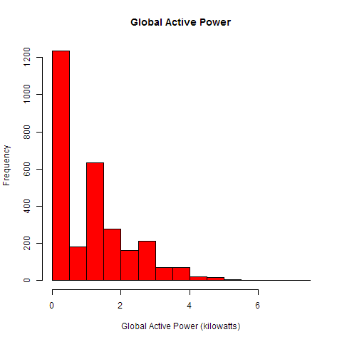
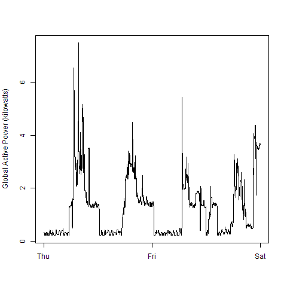
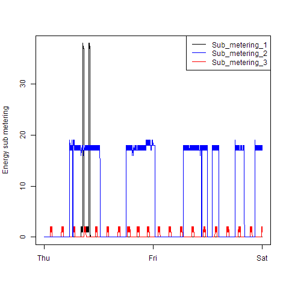
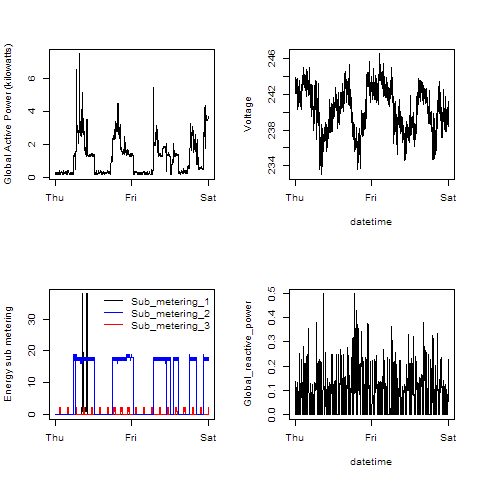

# Assignment 1 
Dear Reviewer

This Repository contains the R code for generating four different plots from the following dataset: 

 <a href="https://d396qusza40orc.cloudfront.net/exdata%2Fdata%2Fhousehold_power_consumption.zip">Electric power consumption</a> [20Mb]
 
The code files are labelled

* `plot1.R`
* `plot2.R`
* `plot3.R`
* `plot4.R`

If you run the R-code please make sure that you have the dataset in your working directory labelled as "household_power_consumption.txt"

In addition to the R-Code you can find the resulting diagramm, as png-files:

* `plot1.png` 
* `plot2.png`
* `plot3.png` 
* `plot4.png`

The plots are embedded in this Readme for your convenience. See below.

I hope you had fun and success with your assigment work.

Regards, Tobias

##Plot 1

##Plot 2

##Plot 3

##Plot 4

